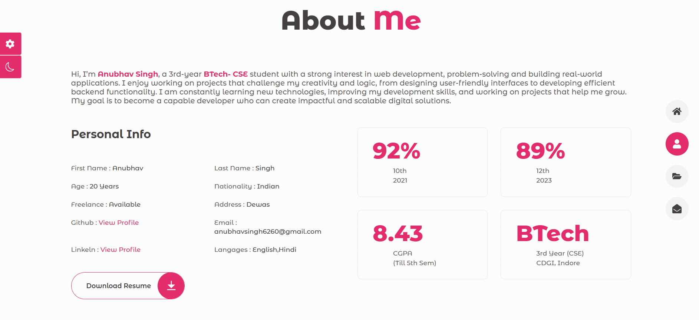
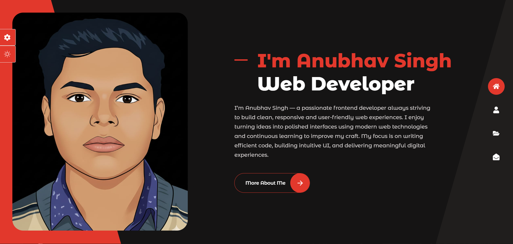
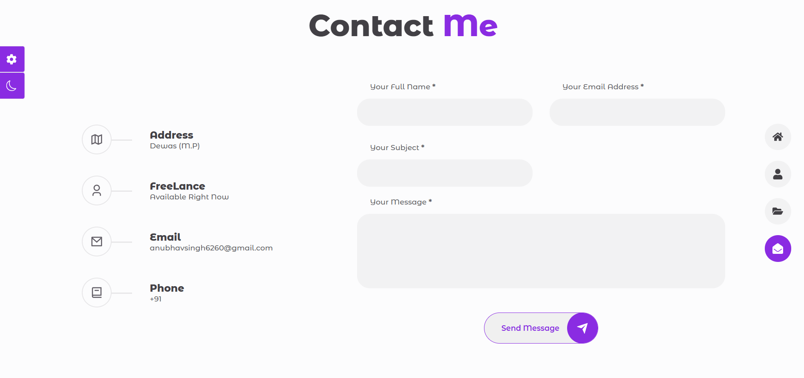

# 🎨 Animated Color-Changing Portfolio

A fully responsive and interactive personal portfolio built using **React.js**, featuring animated UI components, dynamic routing, and a persistent color theme system.

## 🚀 Features

- ⚛️ Built entirely with **React.js**
- 🔀 Smooth navigation using **React Router**
- 🎨 Dynamic color theme switching using **HSL in CSS**
- - 🌙 **Dark/Light mode toggle** with persistent user preference using **Local Storage**
- 💾 Theme persistence using **Local Storage**
- ✨ Animated UI components and transitions
- 📱 Fully responsive design for all screen sizes
- 🧩 Modular and reusable React components

## 🛠️ Tech Stack

- **Frontend:** React.js, JavaScript (ES6+)
- **Routing:** React Router
- **Styling:** CSS (HSL color model), Animations
- **State & Storage:** Local Storage
- **Tools:** Git, GitHub, VS Code

## 📂 Project Structure
``` bash
Portfolio/
├── src/
│ ├── components/
│ ├── pages/
│ ├── styles/
│ ├── App.js
│ └── index.js
├── public/
├── package.json
└── README.md
``` 

## 🎯 Key Highlights

- Implemented a **color-changing theme system** that adapts UI dynamically.
- Ensured **clean component architecture** following React best practices.
- Optimized animations and layouts for **smooth performance**.
- Designed with **user experience and visual aesthetics** as a priority.

## 📸 Preview




## Dark Mode


## Style-Switcher


### 📧 Contact Form

- Integrated **EmailJS** for the contact form to send messages directly to my email.  
- Users can submit their name, email, and message without leaving the website.  
- Implemented form validation and responsive design for smooth user experience.  
- Uses EmailJS service to securely handle email delivery from frontend without a backend server.



## 📌 Getting Started

Clone the repository:

git clone https://github.com/anub1004/Portfolio.git
